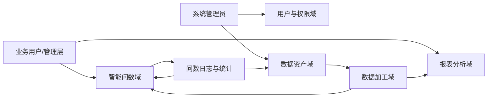
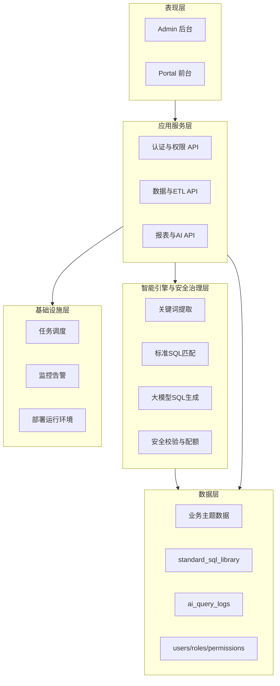
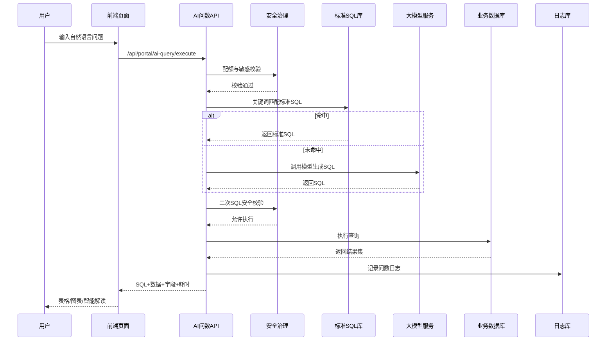

# 4 系统设计（AI 问数增强修订稿）

## 4.1 系统总体架构设计（双视角）
为适配本研究中新增的 AI 智能问数能力，系统总体设计由原有“数据驱动报表”单一视角，升级为“业务架构 + 技术架构”双视角协同模式。业务架构用于回答“系统为谁服务、解决什么业务问题”；技术架构用于回答“系统如何实现、如何保障稳定与安全”。

---

## 4.1.1 业务架构设计
从业务价值角度看，本系统围绕地产企业“业财一体化决策”构建五个核心业务域：
1. 用户与权限域：负责用户认证、角色管理、数据访问控制。
2. 数据资产域：负责数据源接入、元数据管理、标准口径维护。
3. 数据加工域：负责 ETL 抽取、清洗、建模、调度与监控。
4. 报表分析域：负责主题报表、大屏驾驶舱、订阅派发。
5. 智能问数域：负责自然语言问数、SQL 生成执行、可视化解读与审计治理。

在业务流程上，系统形成“数据治理—指标沉淀—可视分析—智能问数—决策反馈”的闭环：
- 管理员维护数据源与指标口径；
- ETL 将多源数据汇聚到统一分析层；
- BI 报表承载标准分析场景；
- AI 问数支持即席分析与问题追问；
- 结果通过日志与统计反馈到标准 SQL 库与配置策略，实现持续优化。

图 4-1 业务架构（建议替换为论文插图）

该业务架构的关键变化在于：AI 问数域不再作为“附属查询功能”，而是与报表分析域并列，成为经营分析主路径之一。

---

## 4.1.2 技术架构设计
在技术实现上，系统采用分层架构，新增“智能引擎与安全治理层”，将 AI 能力纳入可控、可审计的企业级体系。

### （1）表现层（Presentation Layer）
- 前端采用 Vue3 + Element Plus。
- 管理后台提供配置、治理、审计能力。
- 前台门户提供问数输入、图表展示、智能解读、查询历史。

### （2）应用服务层（Application Service Layer）
- 基于 FastAPI 提供 REST API。
- 主要模块：认证授权、数据源管理、ETL 管理、报表管理、AI 配置、问数执行、日志统计。

### （3）智能引擎与安全治理层（AI & Guardrail Layer）
- AI 解析：调用大模型将自然语言转换为 SQL。
- 规则优先：优先匹配标准 SQL 库，未命中再调用模型。
- 安全防护：敏感词过滤、危险语句拦截、敏感表限制、只读查询约束。
- 资源控制：用户级开关与日配额控制，防止滥用。

### （4）数据层（Data Layer）
- 业务数据：ERP/财务相关主题数据。
- 治理数据：用户、角色、权限、数据源、ETL 配置。
- AI 数据：标准 SQL 库、AI 查询日志、配额统计。

### （5）基础设施层（Infrastructure Layer）
- 定时调度与任务执行（ETL/RPA）。
- 日志监控与异常告警。
- 前后端部署与服务健康检查。

图 4-2 技术架构（建议替换为论文插图）

---

## 4.1.3 AI 问数核心流程设计
AI 问数流程采用“规则优先 + 模型兜底 + 双重校验”的策略：
1. 用户输入自然语言问题；
2. 校验用户 AI 开关与剩余配额；
3. 执行敏感词与风险意图检测；
4. 提取关键词并匹配标准 SQL 库；
5. 命中则直接执行标准 SQL，未命中则调用大模型生成 SQL；
6. 对生成 SQL 进行二次安全校验（只读、敏感表、危险操作）；
7. 执行查询并返回数据、字段、耗时；
8. 前端渲染表格与图表，并生成智能解读；
9. 写入问数日志并更新用户当日已用次数；
10. 后台基于日志进行成功率、趋势、热点分析，反哺标准 SQL 库。

图 4-3 AI 问数时序图（建议替换为论文插图）

---

## 4.1.4 架构调整点与收益分析
相较原架构，本次 AI 问数增强带来四项关键调整：
1. 架构层次调整：新增智能引擎与安全治理层，实现 AI 能力可控接入。
2. 业务能力调整：从“固定报表供给”升级为“报表 + 即席问数”双引擎分析。
3. 治理机制调整：新增问数日志、标准 SQL 库、用户配额三类治理机制。
4. 交互模式调整：由“开发定义报表”扩展为“用户自然语言主动探索数据”。

对应收益包括：
- 降低业务人员使用门槛，缩短分析响应链路；
- 提升系统对临时管理问题的覆盖能力；
- 通过日志闭环持续优化问数质量与查询成本；
- 在不破坏原 ETL/BI 架构前提下，平滑引入 AI 能力。

---

## 4.1.5 本章与后续章节衔接建议（可选）
为保证论文结构连贯，建议在第 5 章新增小节“5.6 AI 智能问数模块实现”，并在第 6 章新增“6.4 AI 问数专项测试”，分别对应本章架构设计中的“实现细节”与“验证闭环”。

建议衔接语：
“基于本章提出的业务架构与技术架构，下一章将从接口实现、数据模型、安全机制与可视化交互四个方面，对 AI 智能问数模块进行详细实现说明，并通过专项测试验证其有效性与稳定性。”
