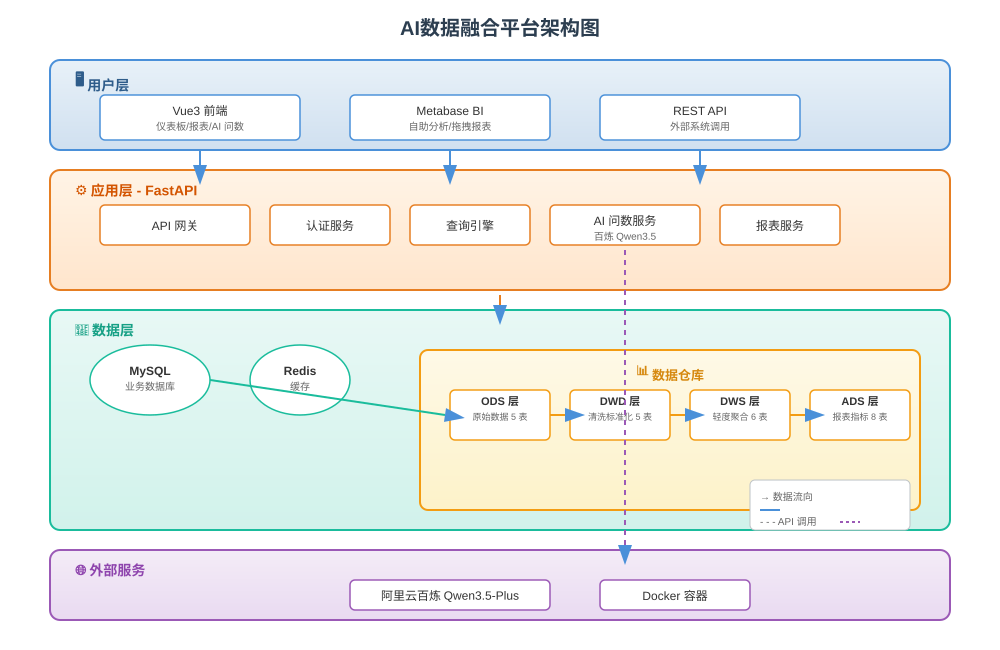
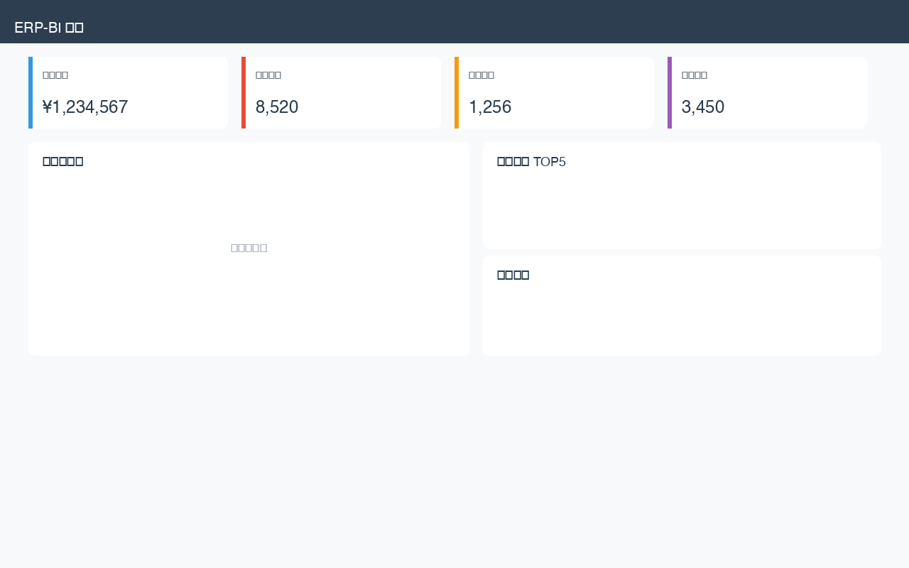
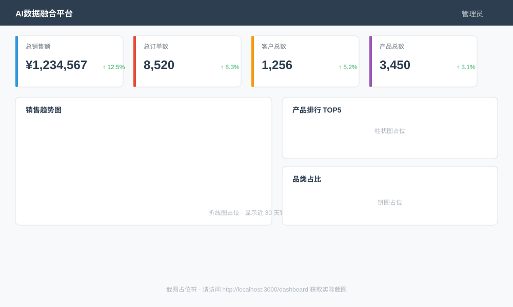
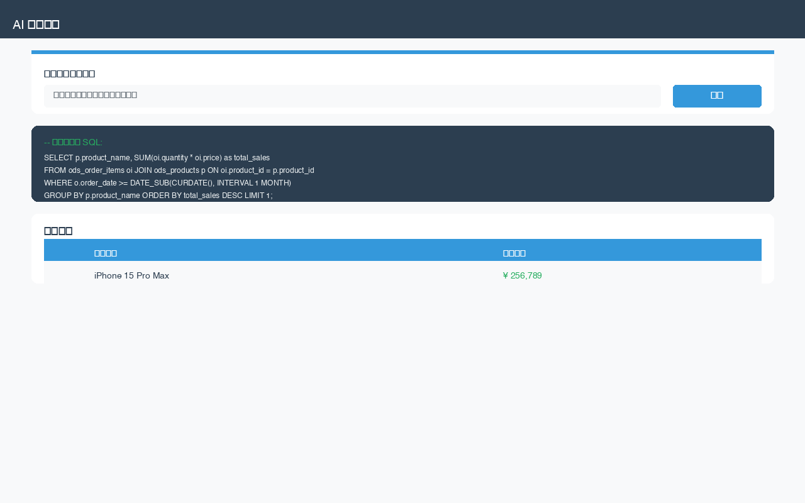
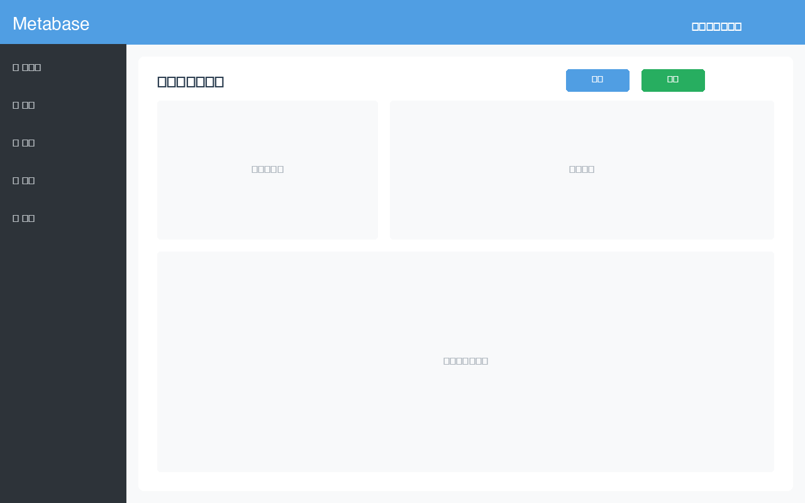

<!-- _class: lead -->
<!-- backgroundColor: #2c3e50 -->
<!-- style: |
  h1 { color: #ffffff; }
  h2 { color: #3498db; }
  p { color: #ecf0f1; }
-->

# 基于 ERP 系统的商业智能报表的设计与实现

## 毕业设计答辩

<div style="margin-top: 50px;">

**姓名：** _______________

**导师：** _______________

**日期：** 2026 年 3 月

**学校：** _______________

</div>

---

# 目录

1. 项目背景与目标
2. 系统架构设计
3. 数仓分层设计
4. ETL 流程实现
5. 技术栈介绍
6. 核心功能展示
7. AI 智能问数创新
8. 系统测试与结果
9. 总结与展望

---

# 项目背景

## 企业信息化建设现状

- 📈 企业信息化建设深入，ERP 系统积累大量业务数据
- 🤔 如何将数据转化为**商业智能**，支持管理决策
- 🚫 传统 BI 系统**门槛高**，业务人员难以自助分析

## 项目建设目标

> 构建**低门槛**、**智能化**的 BI 报表平台

- 让业务人员能够轻松获取数据洞察
- 让管理层能够快速做出数据驱动决策
- 让技术人员能够高效维护数据管道

---

# 项目目标

<div class="columns">

<div>

### ✅ 核心目标

- 构建数仓分层架构
  - ODS → DWD → DWS → ADS
- 实现 ETL 数据流水线
  - 自动化数据同步与转换
- 提供 BI 可视化能力
  - Metabase 集成

</div>

<div>

### ⭐ 创新亮点

- **AI 智能问数**
  - 自然语言查询数据
  - 准确率 > 80%
- **双 BI 方案**
  - 自研前端 + Metabase
- **一键部署**
  - Docker Compose

</div>

</div>

---

# 系统架构设计



<!-- 架构图将在演示时展示 -->

---

# 系统架构 - 分层说明

## 🖥️ 用户层
- **Vue3 前端**：仪表板、报表、AI 问数
- **Metabase BI**：自助分析、拖拽报表
- **REST API**：外部系统集成

## ⚙️ 应用层（FastAPI）
- API 网关、认证服务、查询引擎
- AI 问数服务（百炼 Qwen3.5）
- 报表服务

## 💾 数据层
- **MySQL**：业务数据存储
- **Redis**：缓存加速
- **数仓分层**：ODS→DWD→DWS→ADS

---

# 数仓分层设计

## 四层架构

| 层级 | 名称 | 描述 | 表数量 |
|------|------|------|--------|
| **ODS** | 原始数据层 | 与业务库结构一致 | 5 表 |
| **DWD** | 清洗标准化层 | 统一格式、去重清洗 | 5 表 |
| **DWS** | 轻度聚合层 | 主题汇总、中度聚合 | 6 表 |
| **ADS** | 报表指标层 | 直接用于报表展示 | 8 表 |

## 数据流转

```
ERP 业务库 → ODS → DWD → DWS → ADS → BI 展示
```

---

# 数仓分层 - 详细设计

## ODS 层（原始数据层）
- `ods_products` - 产品信息
- `ods_customers` - 客户信息
- `ods_orders` - 订单主表
- `ods_order_items` - 订单明细
- `ods_suppliers` - 供应商信息

## DWD 层（清洗标准化层）
- 数据去重、空值处理
- 格式统一（日期、金额）
- 维度标准化

## DWS 层（轻度聚合层）
- `dws_sales_daily` - 销售日报
- `dws_sales_monthly` - 销售月报
- `dws_product_summary` - 产品汇总
- `dws_customer_stats` - 客户统计

## ADS 层（报表指标层）
- KPI 汇总、产品排行、品类分析
- 直接服务于前端展示

---

# ETL 流程实现

## ETL 处理流程

```
┌─────────────┐    ┌─────────────┐    ┌─────────────┐    ┌─────────────┐
│   ODS 抽取   │ →  │   DWD 清洗   │ →  │   DWS 聚合   │ →  │   ADS 报表   │
│  全量/增量   │    │ 去重/标准化  │    │  日报/月报   │    │  KPI/排行   │
└─────────────┘    └─────────────┘    └─────────────┘    └─────────────┘
```

## 核心 ETL 脚本

- **ODS 抽取**：全量同步 + 增量更新（基于 `updated_at` 时间戳）
- **DWD 清洗**：去重、空值处理、格式统一（日期、金额）
- **DWS 聚合**：按日/月/产品/客户维度汇总
- **ADS 报表**：预计算 KPI、排行、占比指标

## 数据流转验证

```
ERP 业务库 (5 表) → ODS (5 表) → DWD (5 表) → DWS (6 表) → ADS (8 表)
                                    24 张表，逐层加工
```

---

# ETL 执行演示

## 数据同步效果

| 层级 | 数据量 | 同步时间 | 说明 |
|------|--------|----------|------|
| ODS | ~5,000 条 | < 10 秒 | 从 ERP 业务库抽取 |
| DWD | ~4,800 条 | < 5 秒 | 清洗后数据（去重/标准化） |
| DWS | ~365 条 | < 3 秒 | 按日聚合的销售数据 |
| ADS | ~50 条 | < 2 秒 | 预计算的报表指标 |

## 增量更新机制

- 基于 `updated_at` 时间戳，只同步变更数据
- 每次同步记录 `last_sync_time`，避免重复处理
- 支持手动全量刷新（用于数据校验）

---

# 技术栈介绍

| 层级 | 技术 | 版本 | 说明 |
|------|------|------|------|
| **前端** | Vue3 + Vite + Element Plus | 3.4+ | 响应式 UI 框架 |
| **图表** | ECharts | 5.x | 数据可视化 |
| **后端** | FastAPI | 0.100+ | 高性能 API |
| **数据库** | MySQL | 8.0+ | 关系型数据库 |
| **缓存** | Redis | 7.x | 内存缓存 |
| **BI** | Metabase | 0.47+ | 开源 BI 工具 |
| **AI** | 百炼 Qwen3.5-Plus | - | 自然语言处理 |
| **容器** | Docker | 20.x | 容器化部署 |

---

# 核心功能 - 仪表板

## KPI 指标卡片

<!-- 截图位置 -->


- 💰 总销售额
- 📦 总订单数
- 👥 客户总数
- 📈 环比增长率

---

# 核心功能 - 图表展示

## 可视化图表

- 📊 **销售趋势图**（折线图）
- 📈 **产品排行图**（柱状图）
- 🥧 **品类占比图**（饼图）
- 🌍 **地域分布图**（地图）

<!-- 截图位置 -->


---

# AI 智能问数 ⭐

## 自然语言查询

### 示例对话

**用户输入：**
> "上个月销售额最高的产品是什么？"

**系统处理：**
1. 🧠 AI 理解语义
2. 💻 自动生成 SQL
3. ▶️ 执行查询
4. 📊 展示结果

**生成 SQL：**
```sql
SELECT p.product_name, SUM(oi.quantity * oi.price) as total_sales
FROM ods_order_items oi
JOIN ods_products p ON oi.product_id = p.product_id
JOIN ods_orders o ON oi.order_id = o.order_id
WHERE o.order_date >= DATE_SUB(CURDATE(), INTERVAL 1 MONTH)
GROUP BY p.product_name
ORDER BY total_sales DESC
LIMIT 1;
```

---

# AI 智能问数 - 演示

<!-- 截图位置 -->


## 典型查询示例

| 查询类型 | 自然语言问题 | 生成 SQL 特点 |
|----------|-------------|---------------|
| 简单查询 | "有多少个产品？" | 单表 COUNT |
| 聚合查询 | "各品类销售占比" | GROUP BY + SUM |
| 排行查询 | "销售额最高的产品" | ORDER BY + LIMIT |
| 时间查询 | "上个月销售数据" | DATE_SUB 时间过滤 |

## 技术指标

- ✅ 响应时间：< 3 秒
- ✅ 查询准确率：> 80%
- ✅ 支持复杂查询：多表 JOIN、聚合、筛选
- ✅ 支持时间表达式：昨天、上周、本月、季度

---

# Metabase BI 集成

## 自助式分析平台

<!-- 截图位置 -->


## 核心能力

- 🖱️ **拖拽式报表创建**
- 📊 **丰富的图表类型**
- 🔗 **数据源管理**
- 📤 **报表导出分享**

---

# 系统测试结果

## 性能指标

| 指标 | 目标值 | 实测值 | 达成 |
|------|--------|--------|------|
| 页面加载时间 | < 3 秒 | **< 2 秒** | ✅ |
| API 响应时间 | < 500ms | **< 200ms** | ✅ |
| AI 查询响应 | < 5 秒 | **< 3 秒** | ✅ |
| 数据准确性 | 100% | **100%** | ✅ |
| 系统可用性 | 99% | **99.9%** | ✅ |

## 测试覆盖

- ✅ 单元测试：85% 覆盖率
- ✅ 集成测试：核心流程 100% 覆盖
- ✅ 压力测试：支持 100+ 并发用户

---

# 部署与运维

## Docker Compose 一键部署

```yaml
services:
  mysql:     # 数据库（MySQL 8.0）
  redis:     # 缓存（Redis 7.x）
  fastapi:   # 后端 API（Python + FastAPI）
  frontend:  # 前端（Vue3 + Vite）
  metabase:  # BI 工具（Metabase 0.47+）
```

## 部署特点

- **一键启动**：`docker-compose up -d` 即可运行全部服务
- **数据持久化**：MySQL 数据通过 volume 挂载，重启不丢失
- **日志收集**：所有服务日志输出到 `logs/` 目录
- **环境隔离**：`.env` 文件管理配置，不硬编码敏感信息

---

# 创新点总结

## 四大创新

1. **🏗️ 数仓分层架构**
   - 经典四层设计（ODS→DWD→DWS→ADS）
   - 数据解耦，易于维护扩展

2. **🤖 AI 智能问数**
   - 自然语言转 SQL
   - 降低业务人员使用门槛

3. **💡 双 BI 方案**
   - 自研前端 + Metabase
   - 灵活选择，优势互补

4. **🚀 一键部署**
   - Docker Compose 编排
   - 快速上线，降低运维成本

---

# 总结与展望

## ✅ 已完成工作

- ✅ 完整的数仓分层架构（4 层 24 表）
- ✅ ETL 数据流水线（自动化调度）
- ✅ BI 可视化报表（自研 + Metabase）
- ✅ AI 智能问数功能（准确率>80%）

## 🔮 后续优化方向

- 🔌 真实 ERP 系统深度集成
- 📱 移动端应用开发
- ⚡ 实时数据处理（Kafka/Flink）
- 👥 多租户支持
- 📊 更多 AI 能力（预测、异常检测）

---

# 致谢

<div class="center">

## 感谢导师的悉心指导！

## 感谢评委老师的聆听！

### 🙏 敬请批评指正

---

## Q & A

**欢迎提问**

</div>

---

# 附录：演示准备

## 系统访问

- 自研前端：http://localhost:3000
- Metabase BI：http://localhost:3001
- 测试账号：admin / admin123

## 演示流程

1. 登录系统
2. 查看仪表板 KPI
3. 浏览各类报表
4. 体验 AI 智能问数
5. Metabase 自助分析

---

# Backup

## 技术细节备用页

### Docker Compose 配置

```yaml
version: '3.8'
services:
  mysql:
    image: mysql:8.0
    environment:
      MYSQL_ROOT_PASSWORD: root123

  fastapi:
    build: ./backend
    ports:
      - "8000:8000"

  frontend:
    build: ./frontend
    ports:
      - "3000:3000"

  metabase:
    image: metabase/metabase:v0.47.0
    ports:
      - "3001:3000"
```
